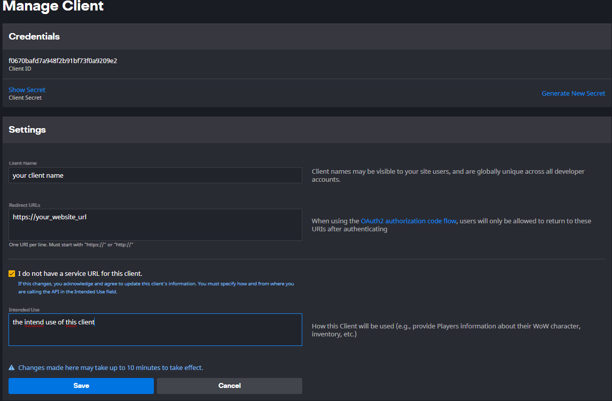

# Origin - Projet de fin de formation Développeur Web Full-Stack

Ce projet est un site de recrutement pour une guilde de joueurs de World of Warcraft 

## 🚀 Installation

1. **Clonez le dépôt :**

git clone https://github.com/Nicolas-Fa/origin-site.git

2. **Configurez la base de données sur votre serveur local :**

Importez le fichier origin.sql dans votre base de données

3. **Installer les dépendances :**

Installer Composer -npm init -composer install

4. **Créez un fichier .env à la racine de votre projet et ajoutez y les variables nécessaires :**

DB_NAME="" : le nom de votre base de données
DB_HOST="" : l'adresse de l'hôte de votre base de données
DB_PWD="" : le mot de passe utilisé pour vous connecter à la base de données
DB_LOGIN="" : l'identifiant utilisé pour vous connecter à la base de données

5. **Enregistrez vous pour utiliser l'API Blizzard :**

Rendez-vous sur https://develop.battle.net/access/clients afin d'y créer un compte et un client :

6. **Créez un compte Admin dans votre serveur local :**

Allez sur la page d'inscription et renseignez les champs :
Pseudo : le pseudo qui apparaîtra 
email : votre adresse mail, utilisée pour vous connecter par la suite au site
mot de passe

Allez sur la base de données en local puis modifiez votre rôle en "Admin"

Exportez la base de données pour la mettre sur votre serveur